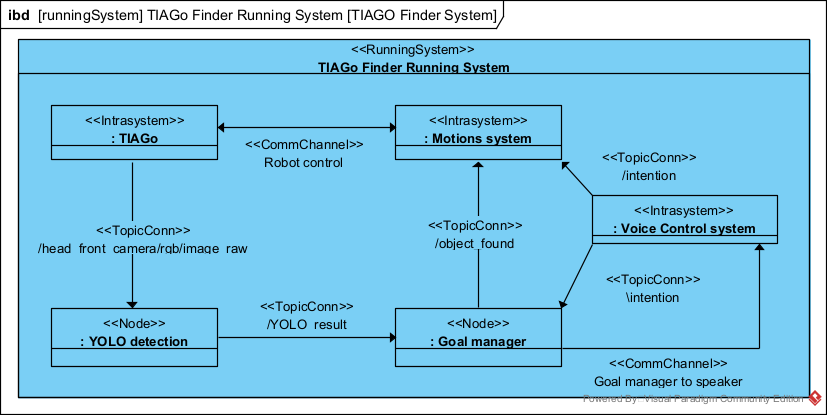
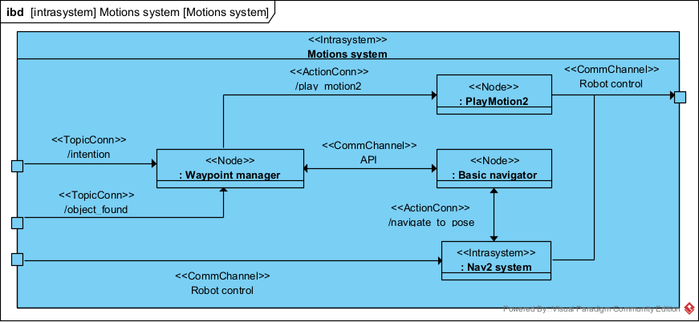
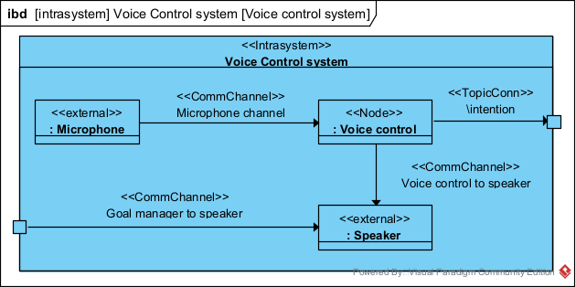

# TIAGo Finder - Control system for TIAGo robot searching for objects

This package consists of configuration files, nodes and launch files that enables TIAGo robot to perform the task of searching for objects in the apartment. It utilizes [packages](https://github.com/pal-robotics) created by PAL Robotics company.


### Configuration
Configuration files are withing the config folder. You can customize your environment in global_config.yaml file. Maps are stored in the maps folder, whereas Gazebo worlds are stored in pal_gazebo_worlds package for consistency. tiago_nav2 file configures robot navigation.
<br>
Waypoints subfolder stores waypoints for each environment in YAML file. When specifying new ones, don't forget to change the path to this file in waypoint_manager node.
<br>
Yolo_models subfolder stores neural network weights for YOLO object detection. When adding new ones, don't forget to change the path to this file in yolo_detection node.

### Running
Launch TIAGo controllers, Gazebo simulation, navigation, RViz2 and YOLO detection by:
```
ros2 launch tiago_finder system_bringup.launch.py arm:=no-arm
```
Launch nodes for performing searching task (goal_manager, waypoint_manager and voice_control) by:
```
ros2 launch tiago_finder object_find_system.launch.py
```

### Package structure
The following MeROS diagrams presents the package structure. Running system:

Motions system:

Voice control system:

